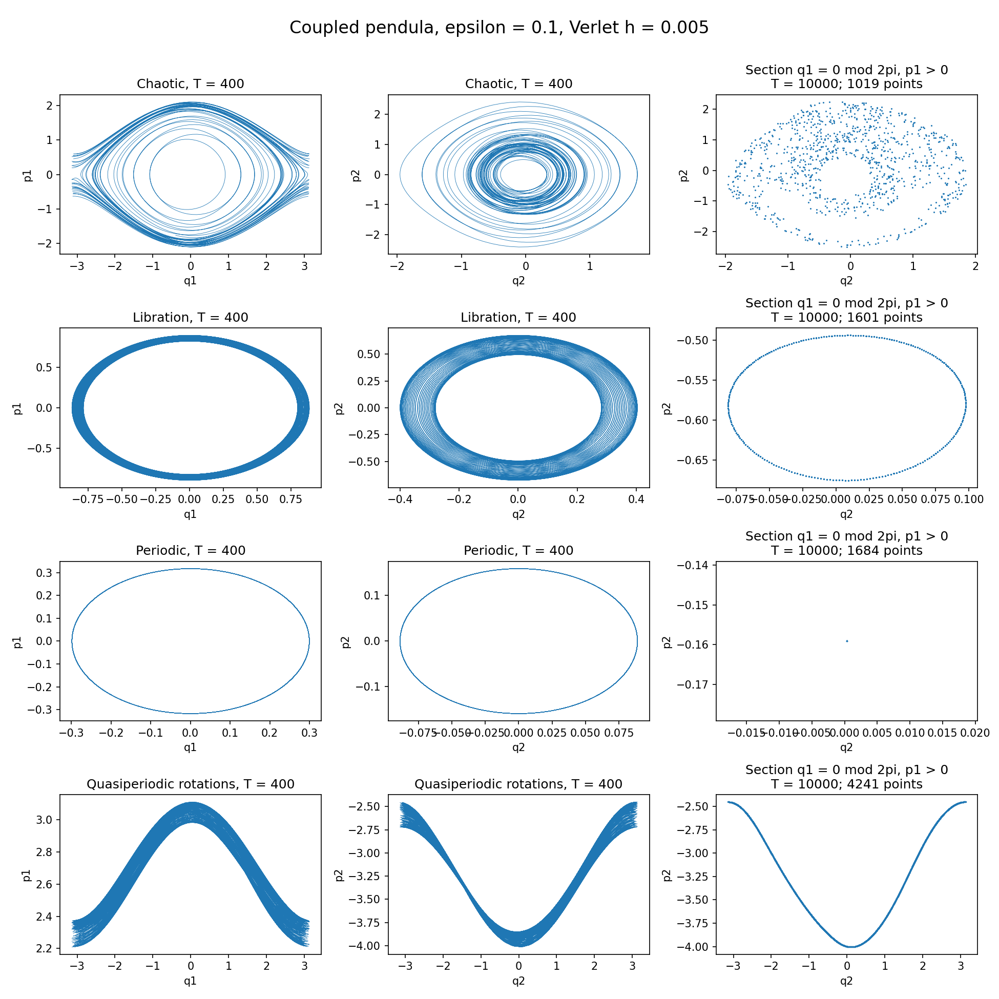

# Coupled-pendulum examples at fixed coupling

All examples use **epsilon = 0.1** and the default physical parameters in
`coupled_pendula.py`: `m1 = m2 = 1`, `l1 = 1`, `l2 = 1.3`, `a = 3`,
`g = k = 1`. State ordering is **(q1, q2, p1, p2)**; angles are in radians
and the last two coordinates are canonical momenta, not angular velocities.
The coupling is fixed, but the examples have different energies.

| Behaviour | Initial state | Energy H | Suggested display time |
| --- | --- | ---: | ---: |
| Chaotic | `(0, 0, 2, 1)` | 2.295857988166 | 1000 |
| Libration | `(0.8, -0.4, 0, 0)` | 0.474283475334 | 400 |
| Periodic | `(0.3, -0.0888544167980643, 0, 0)` | 0.057939567392 | 120 |
| Quasiperiodic rotations | `(0, 0, 3, -4)` | 9.233727810651 | 400 |

Libration means bounded angular oscillation. It overlaps with the other
classifications: the libration example is numerically quasiperiodic, and the
periodic example also librates. The rotational quasiperiodic example has the
pendulums turning in opposite directions.



The left and middle columns show phase projections to `T = 400`; the right
column shows Poincare sections to `T = 10000`. All panels use `h = 0.005`.

## Run the examples

Run a command from the project directory, then click **Run** in the window.
The `--initial-state` option selects the exact coordinates, avoiding mouse
placement errors, which matter especially for the periodic orbit.

```bash
# Chaotic
python3 codes/coupled_pendula.py --epsilon 0.1 --duration 1000 --initial-state 0 0 2 1

# Libration
python3 codes/coupled_pendula.py --epsilon 0.1 --duration 400 --initial-state 0.8 -0.4 0 0

# Periodic
python3 codes/coupled_pendula.py --epsilon 0.1 --duration 120 --initial-state 0.3 -0.0888544167980643 0 0

# Quasiperiodic rotations
python3 codes/coupled_pendula.py --epsilon 0.1 --duration 400 --initial-state 0 0 3 -4
```

These commands use the default Verlet step `--dt 0.01`. Add `--dt 0.005`
for smaller discretization error. Full phase projections can look thick for
both quasiperiodic and chaotic trajectories; they are not Poincare sections.

## Classification and numerical checks

The selected trajectories were integrated with the project's
`integrateTrajectory` function to **T = 10000**, with both **h = 0.01** and
**h = 0.005**. Poincare sections used `q1 = 0 modulo 2*pi`, `p1 > 0`, with
linear interpolation between integration steps.

### Chaotic

For `(0, 0, 2, 1)`, the Poincare section is a scattered two-dimensional cloud.
Pendulum 1 exhibits irregular librations and rotations. Pendulum 2 remains
confined, consistent with the energy being below its gravitational barrier 2.6.

Finite-time largest Lyapunov estimates, obtained by evolving a nearby orbit
and renormalizing its separation to `1e-7` every time unit, were:

| T | h = 0.01 | h = 0.005 |
| ---: | ---: | ---: |
| 1000 | 0.08160 | 0.08376 |
| 2000 | 0.09483 | 0.08333 |
| 5000 | 0.10154 | 0.08090 |
| 10000 | 0.08054 | 0.07546 |

The initial perturbation direction was `(0.37, -0.51, 0.63, 0.45)`, normalized
in the Euclidean norm of the canonical coordinates. Persistence of a positive
estimate under longer integration and step refinement supports chaos; the
precise finite-time value varies as the orbit explores the chaotic region.

### Libration

For `(0.8, -0.4, 0, 0)`, confinement follows directly from energy conservation:
the kinetic and spring energies are nonnegative, and reaching `q1 = +/-pi`
requires `H >= 2`, while reaching `q2 = +/-pi` requires `H >= 2.6`.
Here `H = 0.474283475334`, so neither pendulum can leave its initial well.

At `h = 0.005`, sampled angle ranges over `T = 10000` were approximately
`q1 in [-0.87130, 0.88735]` and `q2 in [-0.40000, 0.40425]`.
The Poincare points lie on a closed curve, and the finite-time Lyapunov
estimate decreases from `0.00427` at `T = 1000` to `0.000652` at `T = 10000`,
consistent with quasiperiodic libration.

### Periodic

For `(0.3, -0.0888544167980643, 0, 0)`, the period of the continuous system is

```text
P = 5.938156672603949
```

This is a nontrivial nonlinear periodic orbit. It was obtained by fixing
`q1(0) = 0.3`, setting both initial momenta to zero, and solving for `q2(0)`
and a half-period `tau` such that both momenta vanish again at `tau`.
Time reversibility then closes the orbit at `P = 2*tau`. The shooting seed
was the higher-frequency linear normal mode at the origin.

Using SciPy DOP853 for the exact vector field, with `rtol = 3e-14` and
`atol = 3e-15`, the full-period infinity-norm closure residual was
`3.8e-14` or less. Verlet closure errors over the same period were approximately
`9.19e-6` and `2.30e-6`, with constant steps just below `0.01` and `0.005`
respectively, chosen to land exactly at `P`. Thus the supplied coordinates
describe the continuous periodic orbit to numerical accuracy; the fixed-step
GUI trajectory has the expected discretization error.

### Quasiperiodic rotations

For `(0, 0, 3, -4)`, the Poincare section follows a smooth invariant-looking
curve, with both pendulums rotating in opposite directions. Weighted time
averages of `qdot = p/inertia`, at `h = 0.005`, give angular rotation rates

```text
omega1 =  2.66491636
omega2 = -1.88464031
omega1 / omega2 = -1.4140185489
```

These averages use the smooth weight `exp(-1/(s*(1-s)))`, with normalized
time `0 < s < 1`. The frequency ratio agrees between the first and second
5000-time-unit halves to about `2.5e-10`. At `h = 0.01` it is
`-1.4140181676`, showing a small discretization shift.
The finite-time Lyapunov estimate at `h = 0.005` decreases from `0.00678`
at `T = 1000` to `0.00134` at `T = 10000`. Together these diagnostics support
quasiperiodicity; finite-time computations do not prove an irrational
frequency ratio or the existence of an invariant torus.

### Energy-error check

Maximum `abs(H(t)-H(0))/(1+abs(H(0)))` over the full integrations:

| Example | h = 0.01 | h = 0.005 |
| --- | ---: | ---: |
| Chaotic | 1.52e-5 | 3.80e-6 |
| Libration | 8.50e-6 | 2.12e-6 |
| Periodic | 1.54e-6 | 3.84e-7 |
| Quasiperiodic rotations | 2.25e-5 | 5.61e-6 |

The approximately fourfold reduction is consistent with the second-order
Störmer--Verlet scheme.
